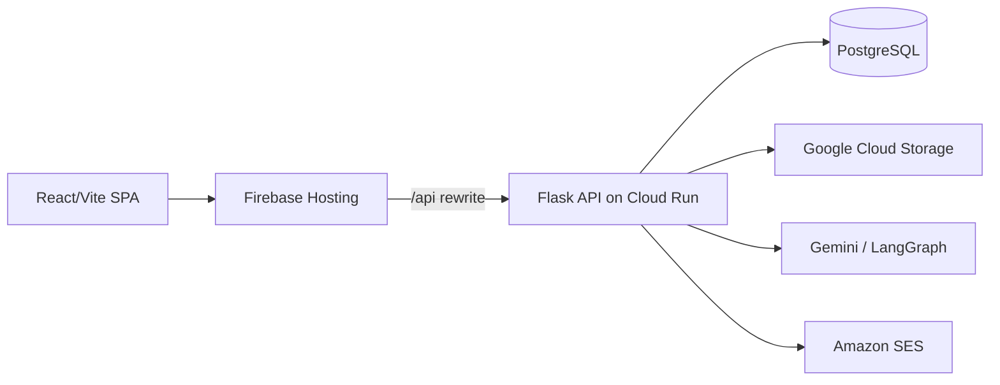

# Architecture

## System Context



## Backend

Backend code is domain-oriented under `backend/app/`. Routes own HTTP parsing,
authentication boundary checks, request validation, service/tool calls, and response
mapping. Shared cross-domain logic belongs in `app/core/` and `app/tools/`.

Primary domains:

- `auth/`: register, login, email verification, password reset, OAuth.
- `workspaces/`, `projects/`, `tasks/`: core workspace data model and CRUD.
- `calendar/`: events, availability, schedule proposals.
- `chat/`: chat sessions, SSE streaming, agent run integration.
- `agents/`: ExecutionContext, AgentRun, AgentAction, planning, scheduling, research,
  mastery, adaptation, undo, and deterministic action execution.
- `organizations/`: organization membership, custom roles, RBAC helpers.
- `documents/`: metadata, upload/download/delete boundaries, GCS storage wrapper.
- `core/`: config, extensions, logging, authz, security primitives, rate limiting.

Dependency direction:

```text
routes -> services/tools -> repositories/models
agents -> ActionExecutor -> deterministic tools/services
tools -> core authz/execution context -> models
```

## Frontend

Frontend code is organized around application surfaces and reusable feature modules.

- `api/`: HTTP client modules and SSE client logic.
- `contexts/`: auth/workspace state.
- `layouts/`: personal and company shells.
- `pages/`: route-level screens.
- `features/`: chat, schedule, team, ideas, modules, documents, boards.
- `styles/`: semantic design tokens.

Dependency direction:

```text
UI components -> hooks/context -> api clients -> backend
```

## Auth And Multi-Tenancy

The frontend stores bearer JWTs in localStorage and sends them in the `Authorization`
header. The backend must not trust frontend auth state. Protected routes use
`@jwt_required()` and resource access must be checked server-side.

Workspace isolation is based on `user_can_access_workspace(user_id, workspace_id)`.
Object IDs alone are never sufficient authorization.

## Agentic Control Plane

Agent execution uses trusted server-side context:

- `ExecutionContext`: authoritative user/workspace/scope.
- `AgentRun`: durable run record.
- `AgentAction`: proposed/applied/reversible action record.
- `ActionExecutor`: deterministic execution and verification boundary.

LLM/tool arguments are treated as untrusted suggestions. The execution context remains
authoritative for user ID, workspace ID, scope, tool identity, and authorization.

## Major Data Flows

- Chat: frontend SSE request -> `chat/routes.py` -> trusted context -> LangGraph agent
  -> tools/action executor -> streamed events.
- Planning: plan request -> proposal record -> confirm/apply -> action executor.
- Scheduling: calendar availability/events -> schedule proposal -> apply -> event/task
  updates.
- Documents: upload request -> workspace authz -> filename/type/size validation -> GCS
  storage -> document metadata.
